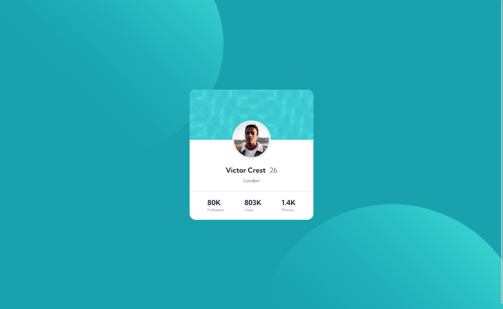

# Frontend Mentor - Profile card component solution

This is a solution to the [Profile card component challenge on Frontend Mentor](https://www.frontendmentor.io/challenges/profile-card-component-cfArpWshJ). Frontend Mentor challenges help you improve your coding skills by building realistic projects.

## Table of contents

- [Overview](#overview)
  - [The challenge](#the-challenge)
  - [Screenshot](#screenshot)
  - [Links](#links)
- [My process](#my-process)
  - [Built with](#built-with)
  - [What I learned](#what-i-learned)
- [Author](#author)

## Overview

### The challenge

- Build out the project to the designs provided

### Screenshot

### Links

- Solution URL: [repo](https://github.com/rohitKumar38344/Frontend-Mentor---Profile-card-component)
- Live Site URL: [site](https://hopeful-ride-d32235.netlify.app/)

## My process

### Built with

- Semantic HTML5 markup
- CSS
- Flexbox

### What I learned

Use of background proprty in CSS

## Author

- Website - [RohitKumar](https://github.com/rohitKumar38344)
- Frontend Mentor - [@rohitKumar38344](https://www.frontendmentor.io/profile/rohitKumar38344)
- Twitter - [@\_iamrohitKumar](https://twitter.com/_iamrohitKumar)
